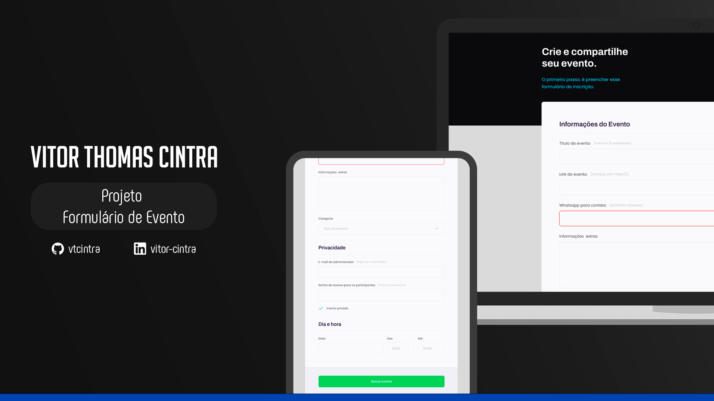

<h1 align="center"> Event Form </h1>

  <a href="#-tecnologias">Tecnologias</a>&nbsp;&nbsp;&nbsp;|&nbsp;&nbsp;&nbsp;
  <a href="#-projeto">Projeto</a>&nbsp;&nbsp;&nbsp;|&nbsp;&nbsp;&nbsp;
  <!-- <a href="#-layout">Layout</a>&nbsp;&nbsp;&nbsp;|&nbsp;&nbsp;&nbsp; -->
  <a href="#memo-licença">Licença</a>

  

 

  

## 🚀 Tecnologias

Esse projeto foi desenvolvido com as seguintes tecnologias:

- HTML e CSS
- Git e Github

## 💻 Projeto

O projeto consiste em um formulário de eventos, para preencher com as informações e submeter no botão ao final da página.  

- [Acesse o projeto finalizado, online](https://github.com/vtcintra/event-form)

## :memo: Licença

Esse projeto está sob a licença MIT.

---

VITOR THOMAS CINTRA